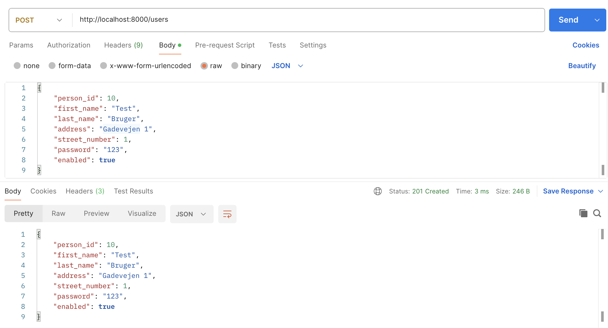
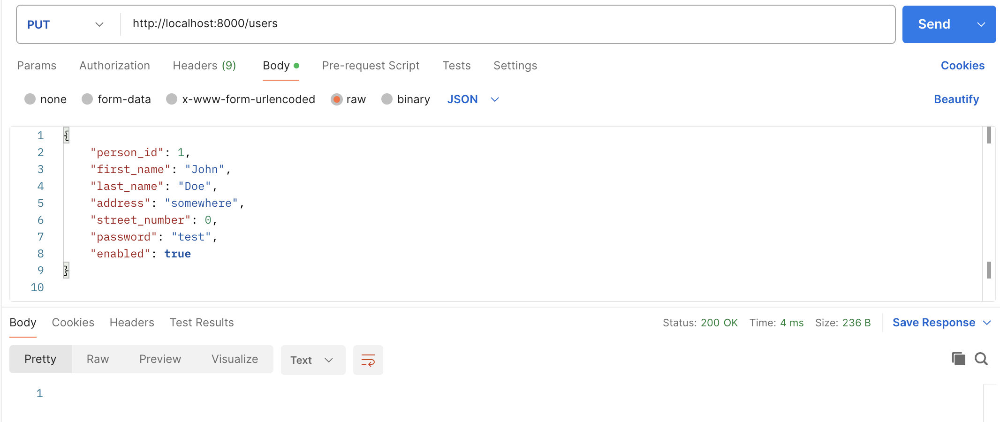

# Udarbejdelse af REST API
## Implementation

REST API er blevet implementeret i GO. Der bliver brugt en flat file som database og det er struktureret således: 
- models/ indeholder user modellen
- services/ indeholder CRUD metoder for User
- handlers/ indeholder API endpoints for CRUD af User

## Resultat
Test af GET Endpoint:

Test af POST Endpoint:

Test af PUT Endpoint:

TEST af DEL Endpoint:

