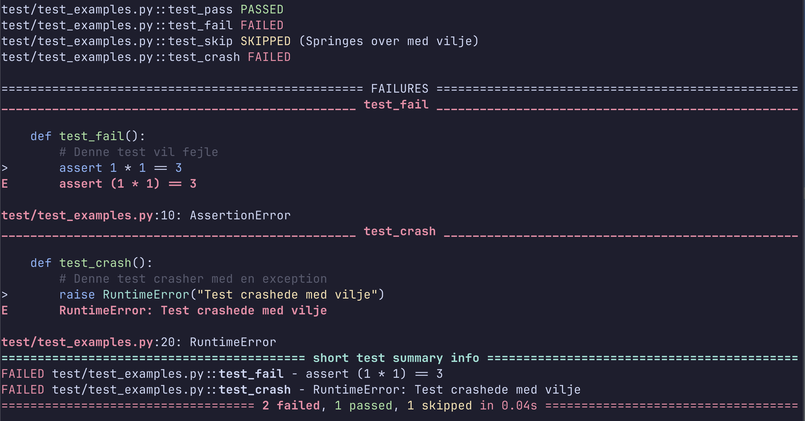
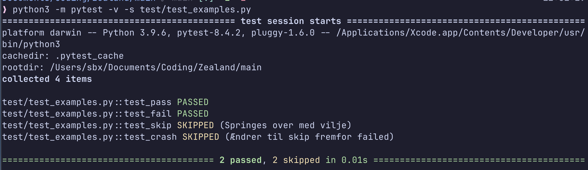

# It_sikkerhed_2026f
Dette er et skole projekt på Zealand Næstved

# 03/02-2026
## Pytest opgaver
Her er resultat af test inden "leg"

Her er resultat af test efter "leg"

Her er resultat af tilføjet test

# 05/02-2026
## Ækvivalens klasser
Rollebasert adgangskontrol (RBAC) kan være et sted hvor Ækvivalens klasser kan bruges til at teste adgangen. Man kan lave en ækvivalens klasse pr. rolle 

| Ækvivalent klasser | Create | Get | Update | Delete |
|--------------------|--------|-----|--------|--------|
| Admin User         |    x   |  x  |    x   |    x   |
| Normal User        |        |     |    x   |        |
| HR User            |    x   |  x  |    x   |        |

## Grænseværdi test
Bruger fartgrænser som grænseværdi:
hastighed <= 50km/t 
- 49km/t -> ja
- 50km/t -> ja
- 51km/t -> nej

PS: Denne er lavet før valgt REST API som It-sikkerheds emne

## CRUD
Test af CRUD funktionalitet er noget der bliver testet især ved REST API'er, som kan ses herunder:

| Operation | Rolle       | Tilladt? |
|-----------|-------------|----------|
| POST      | Admin       |    Ja    |
| POST      | User        |    Nej   |
| GET       | Admin       |    Ja    |
| GET       | User(egen)  |    Ja    |
| GET       | User(Anden) |    Nej   |
| PUT       | Admin       |    Ja    |
| PUT       | User(egen)  |    Ja    |
| PUT       | User(Anden) |    Nej   |
| Delete    | Admin       |    Ja    |
| Delete    | User        |    Nej   |

## Cycle process test
Der kan laves cycle process test ud fra vores CRUD operationer, som blev vist før i CRUD testen.

| Trin | Operation | Forudsætning        | Forventet resultat |
| ---- | --------- | ------------------- | ------------------ |
| 1    | Login     | Gyldige credentials | Token udstedes     |
| 2    | Create    | Gyldigt token       | Ressource oprettes |
| 3    | Read      | Gyldigt token       | Data returneres    |
| 4    | Update    | Gyldigt token       | Data opdateres     |
| 5    | Logout    | Token aktivt        | Token invalideres  |
| 6    | Read      | Token ugyldigt      | 401 Unauthorized   |

Den her er en meget overordnet process, hvor man kunne gøre den mere specifik for hver operation.

## Test Pyramiden
Jeg har igen gået ud fra et sikkerhedsperspektiv mod REST API'er og med test pyramiden er der to veje man kan gå. Begge veje anvender de samme testniveauer, men fokus er forskelligt for dem.

| Testniveau           | Bottom-up perspektiv (opbygning)                               | Top-down perspektiv (validering)                                      |
| -------------------- | -------------------------------------------------------------- | --------------------------------------------------------------------- |
| **Unit test**        | Tester små, isolerede komponenter og logik                     | Bruges til at lokalisere fejl fundet højere oppe                      |
| **Integration test** | Tester samspil mellem interne komponenter (fx API og database) | Bruges til at finde hvilken integration der forårsager en fejl        |
| **System test**      | Tester hele systemet som én samlet enhed                       | Validerer at systemet opfylder funktionelle og sikkerhedsmæssige krav |
| **End-to-end test**  | Tester komplette flows efter systemet er bygget op             | Tester brugerrejser og giver overblik over systemets funktion         |

## Decision table test
Jeg har udarbejdet et decision table som går ud fra DELETE operationen, så for en REST API ville endpoint se således ud: DELETE /api/users/{id}. 
Vi kan stille de tabellen op således:

| Regel | Gyldigt token | Admin | Ejer | Resultat         |
| ----- | ------------- | ----- | ---- | ---------------- |
| R1    | Nej           | –     | –    | 401 Unauthorized |
| R2    | Ja            | Ja    | –    | Tilladt          |
| R3    | Ja            | Nej   | Ja   | 403 Forbidden    |
| R4    | Ja            | Nej   | Nej  | 403 Forbidden    |

## Security gates

- Code/Dev Gate
Da gate Code/Dev har med input validering at gøre, ville jeg ligge CRUD, Grænseværdi. 

- Integration Security Gate
 
- System Security Gate

- Realese Candidate Security Gate

- Go / No-Go Security Gate

